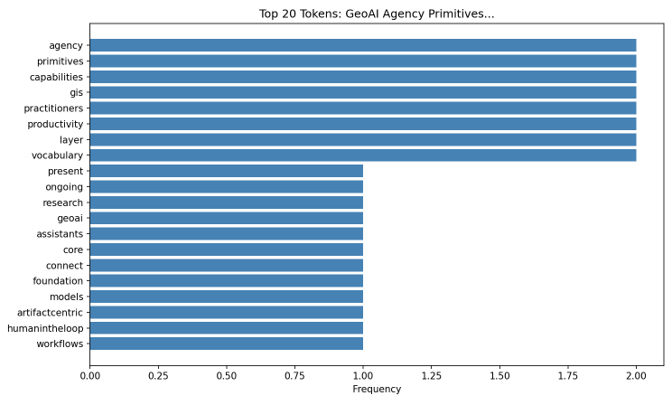
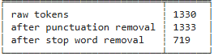
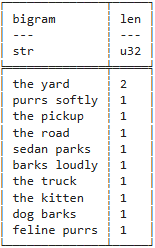

## Web Mining & Natural Language Processing Portfolio

Molly Shelhamer

2026-04

This page summarizes my work on **Web Mining & NLP** projects.

## 1. NLP Techniques Implemented

- Tokenization
  - Tokenized raw text from various data sources
    - document, html, api
- Frequency analysis
  - Using tokens, created visualizations or dataframes that illustrate both the frequency of tokens (unigrams & bigrams) and the context in which they appear
  
- Text cleaning and normalization
  - Removed capitalization & punctuation
  - Removed stop words (it, and, for, etc.)
  
- API-based text analysis
  - Utilized APIs and processed JSON responses for text processing
- Web scraping / content extraction from HTML
  - Used BeautifulSoup to scrape articles, websites, or papers
  - Extracted text content from HTML for further processing

## 2. Systems and Data Sources

- Analyzed web pages (HTML structure)
  - Parsed nested tags
  - Removed artifacts
- Reviewed JSON data returned from APIs
  - Key-value pairs
- Processed plain text from CSV files
  - Manual cleaning

Example: Link to raw and processed JSON data
https://github.com/MollyShelhamer/nlp-04-api-text-data/blob/main/data/raw/shelhamer_raw.json
https://github.com/MollyShelhamer/nlp-04-api-text-data/blob/main/data/processed/shelhamer_processed.csv

## 3. Pipeline Structure (EVTL)

Extract (from source): Data was either stored locally or extracted with scraping tools, API calls, or HTML requests
Validate: Removed empty fields, kept consistent format, and filtered content.
Transform: Tokenization, lemmatization, sentiment scoring, feature extraction
Load (to sink): CSV files, visualizations, or images

Example EVTL: https://github.com/MollyShelhamer/nlp-06-nlp-pipeline/blob/main/src/nlp/pipeline_web_html_shelhamer.py

## 4. Signals and Analysis Methods

- Word frequency computed with FreqDist
- Conext and/or co-occurance with n-gram analysis
  
- Keyword extraction using RAKE
- Special signals like proper nouns via spaCy

## 5. Insights

- API is preferable for text processing
- HTML is trickier to process, but it has its place in the absense of an API.
- Tokenization provides useful context, depending on how it is performed
- Most pipelines were easily modified to pull from various sources

## 6. Representative Work

- nlp-03-text-exploration
https://github.com/MollyShelhamer/nlp-03-text-exploration

- This project displays my work of tokenizing and cleaning text data, creating frequency distributions and comparisons, creating bigrams and examining co-occurrence.

- nlp-06-nlp-pipeline
https://github.com/MollyShelhamer/nlp-06-nlp-pipeline

- This project showcases an EVTL pipeline that works with HTML data for analysis.

## 7. Skills

- Use both python and jupyter notebooks seperately or in conjunction to work with data
- Pull from local data, plain text, HTML requests, or JSON calls
- Clean messy data within an EVTL pipeline
- Demonstrate repeatable workflows that have wide applications
- Professionally communicate project setup and results
